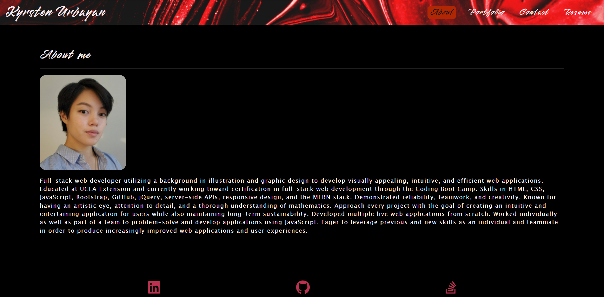

# Kyrsten Urbayan's Portfolio

## Description
A portfolio using React to display my work samples for potential employers and clients.

## Table of Contents
* [Link](#link)
* [React](#react)
* [License](#license)
* [Questions](#questions)

## Link
[Click here](https://kg-phantom.github.io/kyrsten-urbayan/) to go to the deployed portfolio.

## React
This site is built with React.

### Header Component
The `Header` component is used on multiple pages on the site to display the navigation and current page.

### Navigation Component
The `Navigation` component is a child of the `Header` component and takes in the properties `currentPage` and `setCurrentPage` to properly highlight the active page.

### Project Component
The `Project` component is used multiple times on the Portfolio page in order to display the screenshots, links, and information for each project. This component takes in the projects array from `projects.json`, and the array is mapped through in order to render the information for each project.

### Footer Component
The `Footer` component is used on multiple pages to display the icons and links to my LinkedIn, GitHub, and StackOverflow.

### Pages
There are multiple page components `About`, `Contact`, `Portfolio`, and `Resume`.

The `Contact` page features a contact form that informs the user of any missing or invalid inputs.

## License
Source code is licensed under the [MIT](https://choosealicense.com/licenses/mit/) license.

Contents of this site are © Copyright 2021 Kyrsten Urbayan. All rights reserved.

## Questions
- [GitHub](https://github.com/kg-phantom)